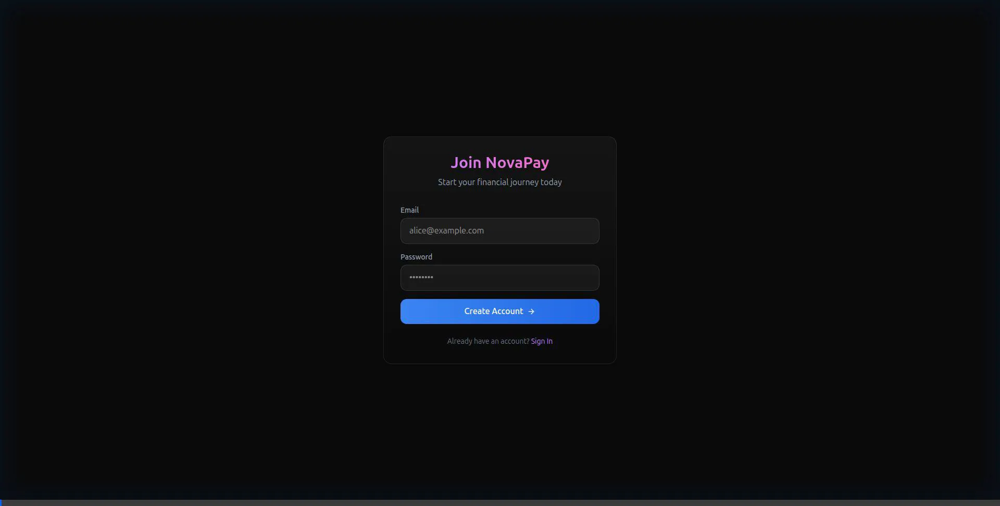
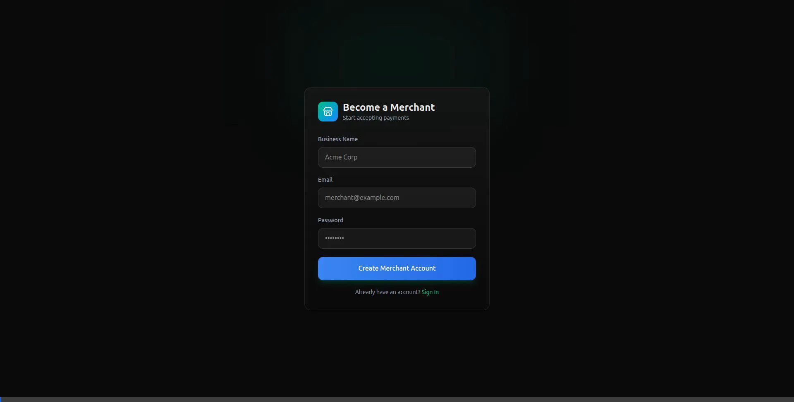

# NovaPay - Production-Grade Fintech Platform

<div align="center">


**A modern, secure fintech platform with double-entry ledger accounting, P2P transfers, and merchant invoicing.**

[Features](#features) • [Quick Start](#quick-start) • [Architecture](#architecture) • [Demo](#demo)

</div>

---

## 🎥 Live Demo

### User Portal - P2P Transfers & Wallet Management



**Features Demonstrated:**
- ✅ User registration and authentication
- ✅ Wallet funding (simulated deposits)
- ✅ P2P money transfers
- ✅ Real-time transaction history
- ✅ Glassmorphism UI with smooth animations

### Merchant Portal - Invoice Management



**Features Demonstrated:**
- ✅ Merchant onboarding with business name
- ✅ Invoice creation and tracking
- ✅ Business dashboard with stats
- ✅ Modern emerald-themed UI

---

## ✨ Features

### Core Banking Features
- 🏦 **Double-Entry Ledger** - ACID-compliant accounting system
- 💸 **P2P Transfers** - Instant money transfers between users
- 💰 **Wallet Management** - Multi-currency wallet support
- 🔐 **Secure Authentication** - JWT-based auth with bcrypt password hashing
- 🔄 **Idempotency** - Prevent duplicate transactions
- 📊 **Transaction History** - Complete audit trail

### Merchant Features
- 🏪 **Merchant Onboarding** - Quick business registration
- 📄 **Invoice Generation** - Create and track payment invoices
- 📈 **Business Analytics** - Revenue and growth metrics
- 💳 **Payment Processing** - Accept payments from users

### Technical Excellence
- ⚡ **High Performance** - Built with NestJS and Next.js
- 🎨 **Modern UI** - Glassmorphism design with Tailwind CSS
- 🔒 **Security First** - Input validation, SQL injection prevention
- 📦 **Monorepo** - Turborepo for efficient development
- 🐳 **Docker Ready** - Containerized infrastructure

---

# NovaPay - Running Instructions

---

## 🚀 Quick Start

```bash
# 1. Start infrastructure
docker compose up -d

# 2. Deploy database schema
npx prisma db push --schema=packages/database/prisma/schema.prisma

# 3. Start backend API
npm run start:dev -w services/api

# 4. Start User Portal (in new terminal)
cd apps/web-user && npm run dev -- -p 3003

# 5. Start Merchant Portal (in new terminal)
cd apps/web-merchant && npm run dev -- -p 3004
```

**Access the portals:**
- 👤 **User Portal**: http://localhost:3003
- 🏪 **Merchant Portal**: http://localhost:3004
- 🔧 **Backend API**: http://localhost:3001

---

## Overview
NovaPay consists of three main components:
1. **Backend API** (NestJS) - Port 3001
2. **User Portal** (Next.js) - Port 3003
3. **Merchant Portal** (Next.js) - Port 3004

## Prerequisites
- Node.js 18+ and npm
- Docker and Docker Compose
- PostgreSQL (via Docker)

## Step 1: Start Infrastructure

```bash
# Navigate to the project directory
docker compose up -d
```

This starts:
- PostgreSQL (port 5432)
- Redis (port 6379)
- MinIO (port 9000)

## Step 2: Deploy Database Schema

```bash
npx prisma db push --schema=packages/database/prisma/schema.prisma
```

## Step 3: Start Backend API

```bash
npm run start:dev -w services/api
```

The API will be available at: **http://localhost:3001**

**Key Endpoints:**
- `POST /auth/register` - Register new user
- `POST /auth/login` - Login
- `GET /auth/profile` - Get user profile
- `GET /wallets` - Get user wallets
- `POST /transfers` - P2P transfer
- `POST /transfers/deposit` - Deposit funds
- `GET /transfers` - Get transfer history
- `POST /merchants` - Create merchant profile
- `GET /merchants/my` - Get merchant profile
- `POST /merchants/invoices` - Create invoice

## Step 4: Start User Portal

```bash
cd apps/web-user
npm run dev -- -p 3003
```

The User Portal will be available at: **http://localhost:3003**

**Features:**
- User registration and login
- View wallet balance
- Send money (P2P transfers)
- Add money (simulated deposits)
- View transaction history

## Step 5: Start Merchant Portal

```bash
cd apps/web-merchant
npm run dev -- -p 3004
```

The Merchant Portal will be available at: **http://localhost:3004**

**Features:**
- Merchant registration with business name
- Create payment invoices
- View invoice history
- Business dashboard with stats

## Testing the Application

### User Portal Flow

1. **Register a User**
   - Go to http://localhost:3003/register
   - Email: `alice@example.com`
   - Password: `password123`
   - Click "Create Account"

2. **Add Funds**
   - Click "Add Money" button
   - This deposits $100.00 USD

3. **Send Money**
   - Get another user's Wallet ID (register a second user or use existing)
   - Enter recipient Wallet ID
   - Enter amount in cents (e.g., 5000 for $50.00)
   - Click "Send Payment"

4. **View History**
   - Scroll down to "Recent Activity"
   - See all sent and received transactions

### Merchant Portal Flow

1. **Register a Merchant**
   - Go to http://localhost:3004/register
   - Business Name: `Tech Store`
   - Email: `merchant@example.com`
   - Password: `password123`
   - Click "Create Merchant Account"

2. **Create Invoice**
   - On the dashboard, enter amount in cents (e.g., 5000 for $50.00)
   - Click "Create Invoice"
   - Invoice appears in "Recent Invoices"

3. **View Stats**
   - Dashboard shows:
     - Total Revenue
     - Invoice count
     - Growth metrics

## Port Summary

| Service | Port | URL |
|---------|------|-----|
| Backend API | 3001 | http://localhost:3001 |
| User Portal | 3003 | http://localhost:3003 |
| Merchant Portal | 3004 | http://localhost:3004 |
| PostgreSQL | 5432 | localhost:5432 |
| Redis | 6379 | localhost:6379 |
| MinIO | 9000 | http://localhost:9000 |

## Troubleshooting

### Port Already in Use
If you see `EADDRINUSE` error:
```bash
# Find process using the port
lsof -i :3001  # or :3003, :3004

# Kill the process
kill -9 <PID>
```

### Database Connection Issues
```bash
# Restart Docker containers
docker compose down
docker compose up -d

# Re-deploy schema
npx prisma db push --schema=packages/database/prisma/schema.prisma
```

### Frontend Build Errors
```bash
# Clear Next.js cache
rm -rf apps/web-user/.next
rm -rf apps/web-merchant/.next

# Reinstall dependencies
npm install
```

## Architecture Notes

- **Double-Entry Ledger**: All financial transactions are recorded using double-entry bookkeeping
- **Idempotency**: Transfers use idempotency keys to prevent duplicate transactions
- **JWT Authentication**: Both portals use JWT tokens stored in cookies
- **API Proxy**: Next.js rewrites `/api/*` requests to the backend API
- **Glassmorphism UI**: Modern dark theme with glass effects and gradients

## Next Steps

- Implement payment processing for invoices
- Add API key generation for merchants
- Implement admin portal for operations
- Add KYC verification flow
- Deploy to production environment
